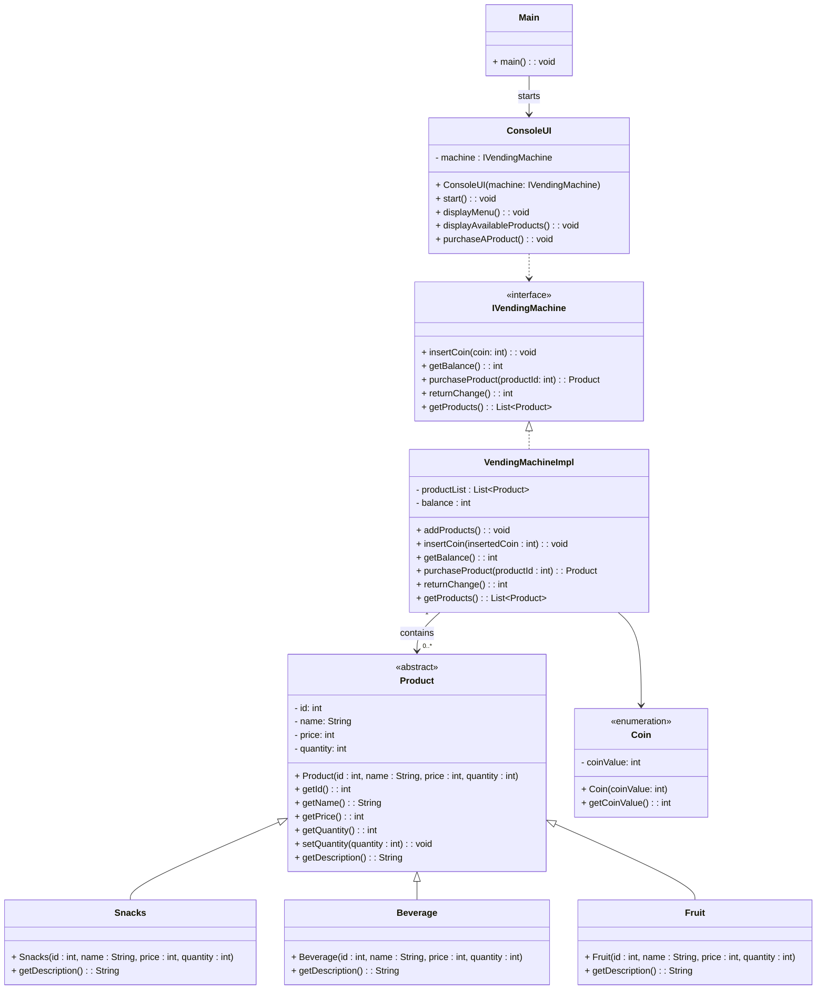

```mermaid
classDiagram
    class IVendingMachine {
        <<interface>>
        + insertCoin(coin: int): void
        + getBalance(): int
        + purchaseProduct(productId: int): Product
        + returnChange(): int
        + getProducts(): List~Product~
    }

    class Product {
        <<abstract>>
        - id: int
        - name: String
        - price: int
        - quantity: int
        + Product(id : int, name : String, price : int, quantity : int)
        + getId(): int
        + getName(): String
        + getPrice(): int
        + getQuantity(): int
        + setQuantity(quantity : int): void
        + getDescription(): String
    }

    class Coin {
        <<enumeration>>
        - coinValue: int
        + Coin(coinValue: int)
        + getCoinValue() : int
    }

    class Snacks {
        + Snacks(id : int, name : String, price : int, quantity : int)
        + getDescription(): String
    }

    class Beverage {
        + Beverage(id : int, name : String, price : int, quantity : int)
        + getDescription(): String
    }

    class Fruit {
        + Fruit(id : int, name : String, price : int, quantity : int)
        + getDescription(): String
    }

    class VendingMachineImpl {
        - productList : List~Product~
        - balance : int
        + addProducts(): void
        + insertCoin(insertedCoin : int): void
        + getBalance(): int
        + purchaseProduct(productId : int): Product
        + returnChange(): int
        + getProducts(): List~Product~
    }

    class ConsoleUI {
        - machine : IVendingMachine
        + ConsoleUI(machine: IVendingMachine)
        + start(): void
        + displayMenu(): void
        + displayAvailableProducts(): void
        + purchaseAProduct(): void
    }

    class Main {
        + main(): void
    }

    Product <|-- Snacks
    Product <|-- Beverage
    Product <|-- Fruit
    IVendingMachine <|.. VendingMachineImpl
    VendingMachineImpl "1" --> "0..*" Product : contains
    VendingMachineImpl --> Coin
    ConsoleUI ..> IVendingMachine
    Main --> ConsoleUI : starts
```